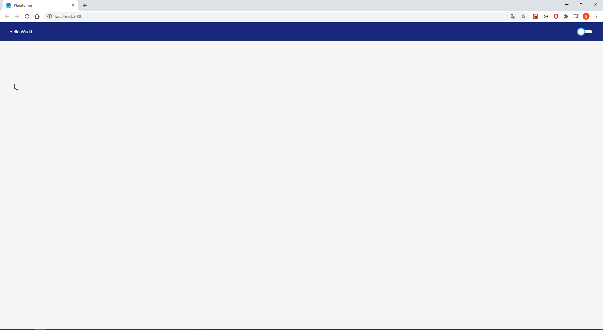
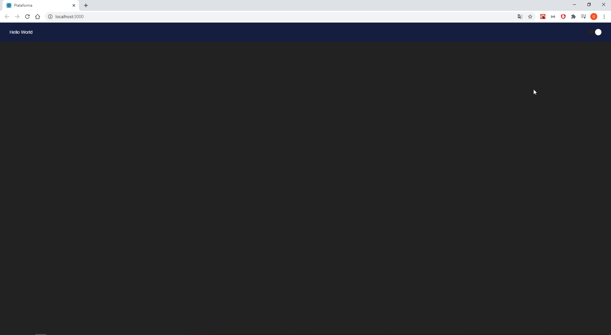

## Aplicação com modo claro e modo escuro

Feito utilizando styled components, useState e um hook personalizado para salvar o modo utilizado no local storage

## view:

Modo claro:

Modo escuro:

### Considerações

Projeto de estudo para conhecimentos em styled component.